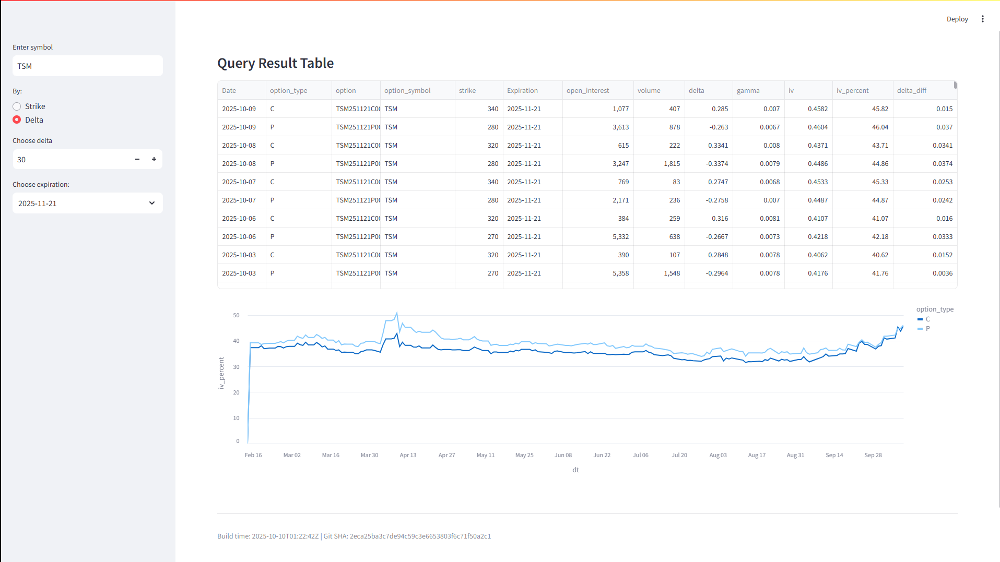

# mztradingdata-streamlit

Streamlit app to explore consolidated options data (Parquet files) using Polars and Altair.


## Screenshots


## Prerequisites
- Linux, macOS, or Windows Subsystem for Linux (WSL)
- Python 3.10+ recommended
- git (optional)

## Setup
1. Create and activate a virtual environment (recommended):

```bash
python -m venv .venv
source .venv/bin/activate
```

2. Install dependencies:

```bash
pip install -r requirements.txt
```

If you plan to use other optional functionality, add those packages as needed.

## Data layout and environment variables
- The app reads Parquet files from the directory specified by the `DATA_DIR` environment variable.
- Default in `app.py`:

```
DATA_DIR=/mnt/c/ws/consolidated-data-by-symbol
```

- Expected layout under `$DATA_DIR`:

```
$DATA_DIR/
	symbol=AAPL/
		part-*.parquet
	symbol=MSFT/
		part-*.parquet
	...
```

- You can set `DATA_DIR` before running the app:

```bash
export DATA_DIR=/path/to/consolidated-data-by-symbol
```

Optional environment variables (displayed in the app footer if set):
- `BUILD_TIME` — build timestamp
- `GIT_SHA` — git commit sha

## Run the app
With the virtualenv active and from the project root:

```bash
streamlit run app.py
```

## How to use
- Enter a ticker symbol in the sidebar (e.g. `AAPL`).
- Choose a filter mode: `Strike` or `Delta`.
	- Strike mode: pick a strike and an expiration date to show IV for that exact contract.
	- Delta mode: pick a target delta (or choose from the available deltas) and an expiration — the app finds the option closest to that delta per date and shows IV over time.
- The main view shows a results table and an IV time-series chart, with separate lines for calls and puts.

## Notes and tips
- The app uses `polars.scan_parquet` for lazy scanning, then collects only the filtered results — this helps with large datasets but initial scans may still take time depending on your storage.
- If your dataset is large, point `DATA_DIR` to a smaller subset (single symbol folder) while experimenting.
- If you want to prefer only calls or puts when using delta, filter by `option_type` before taking the closest delta.


## Troubleshooting
- If Streamlit can't find `app.py`, ensure you're in the repository root when running `streamlit run app.py`.
- If you see import errors, confirm the virtual environment is activated and dependencies installed.

